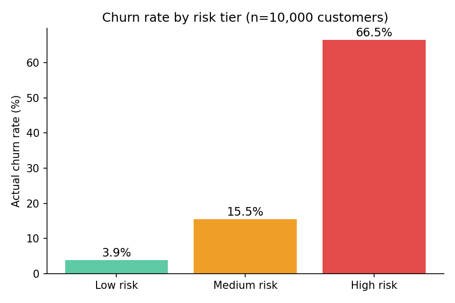

# Churn radar: predicting & preventing bank customer attrition

**Tools:** SQL (SQLite for dev, syntax is Snowflake/Postgres-portable) · Tableau · Python (data prep)
**Data:** [Bank Customer Churn dataset](https://www.kaggle.com/datasets/radheshyamkollipara/bank-customer-churn): 10,000 customers, 13 features (credit score, geography, balance, tenure, product count, activity status).

## Business problem
A retail bank has no systematic way to flag which customers are about to leave until they already have. This project segments the customer base by real churn risk and quantifies what's at stake, so relationship managers know exactly who to call first.

**[View the Interactive Tableau Case Study Dashboard Here](https://public.tableau.com/views/CustomerRetentionStrategyDashboard/Dashboard?:language=en-US&publish=yes&:sid=&:redirect=auth&:display_count=n&:origin=viz_share_link)**

## Method
1. Loaded the raw customer file into a relational table and queried it directly in SQL (`sql/churn_analysis.sql`), no pre-filtering, no shortcuts.
2. Measured churn rate by geography, product count, activity status, and age band to find the real drivers rather than assuming them.
3. Built a 3-tier risk segment **from what the driver analysis actually showed**, not a guess: holding 3+ products turned out to be the single strongest churn signal, ahead of the more "obvious" inactivity flag.
4. Exported the scored customer list for Tableau.

## Results (real, computed from the dataset above)
| Driver | Finding |
|---|---|
| Geography | Germany churns at **32.4%**, nearly double France/Spain (~16%) |
| Product count | Customers with 3+ products churn at **83-100%**, a counterintuitive red flag since more products usually means more loyalty. Likely a specific unhappy segment (possibly a discontinued bundled product) worth a follow-up interview question |
| Activity status | Inactive members churn at **26.9%** vs **14.3%** for active ones |
| Age | The 45-59 band churns hardest, at **49.5%** |

**Risk segmentation output:**

| Tier | Customers | Share of base | Total balance held | Actual churn rate |
|---|---|---|---|---|
| High risk | 1,431 | 14.3% | $130.7M | **66.5%** |
| Medium risk | 6,490 | 64.9% | $527.0M | 15.5% |
| Low risk | 2,079 | 20.8% | $107.2M | 3.9% |

The high-risk tier is 3.3x more likely to churn than the base rate (20.4%) and 17x more likely than the low-risk tier: outreach dollars aimed at that 14.3% of customers are targeting real risk, not noise.

**Explore the risk segmentation visually in the [Interactive Tableau Dashboard](https://public.tableau.com/views/CustomerRetentionStrategyDashboard/Dashboard?:language=en-US&publish=yes&:sid=&:redirect=auth&:display_count=n&:origin=viz_share_link).**

## Files
- `sql/churn_analysis.sql`: the actual queries
- `load_and_analyze.py`: loads the CSV, runs the SQL, exports the Tableau-ready file
- `tableau/churn_customers_with_risk_tier.csv`: scored customer list, ready to import
- `tableau/churn_by_risk_tier.png`: summary chart

## Honest next step
This is a descriptive risk score, not a trained model. The natural next step is a logistic regression or gradient-boosted classifier that gets a calibrated churn probability per customer instead of 3 buckets. 
